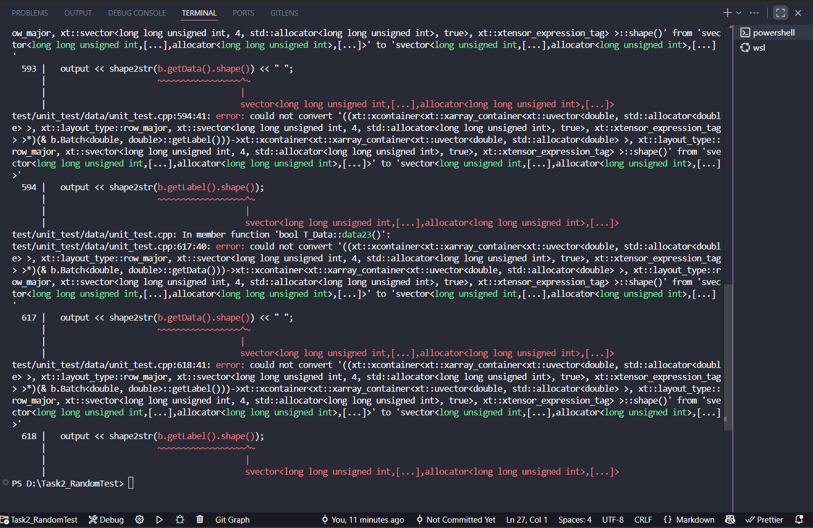
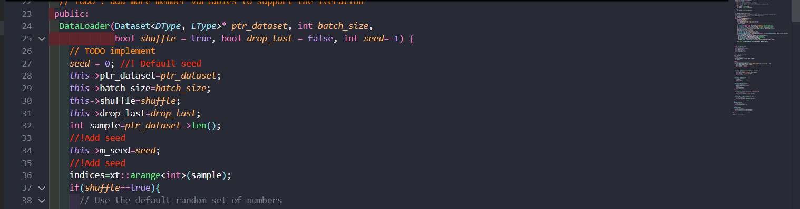
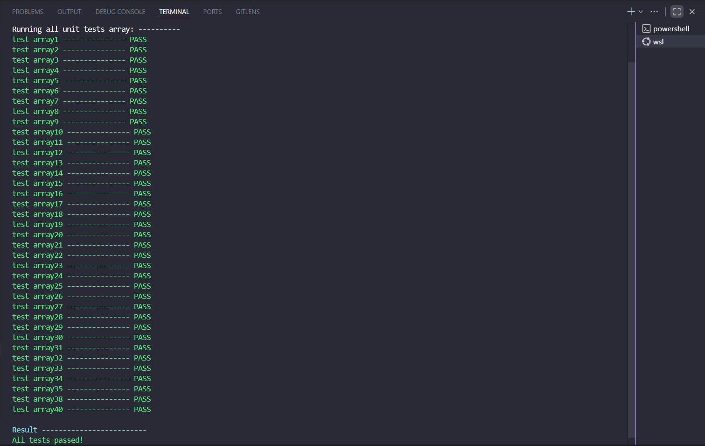
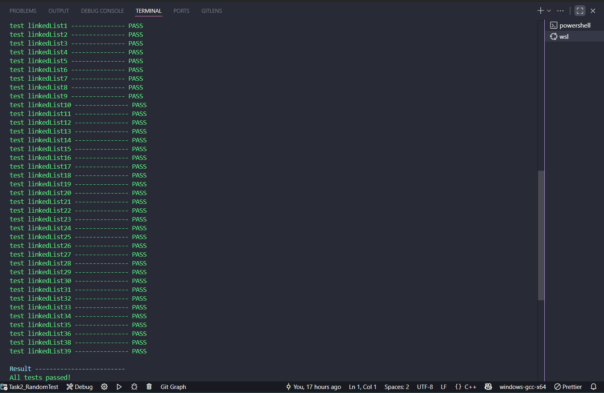
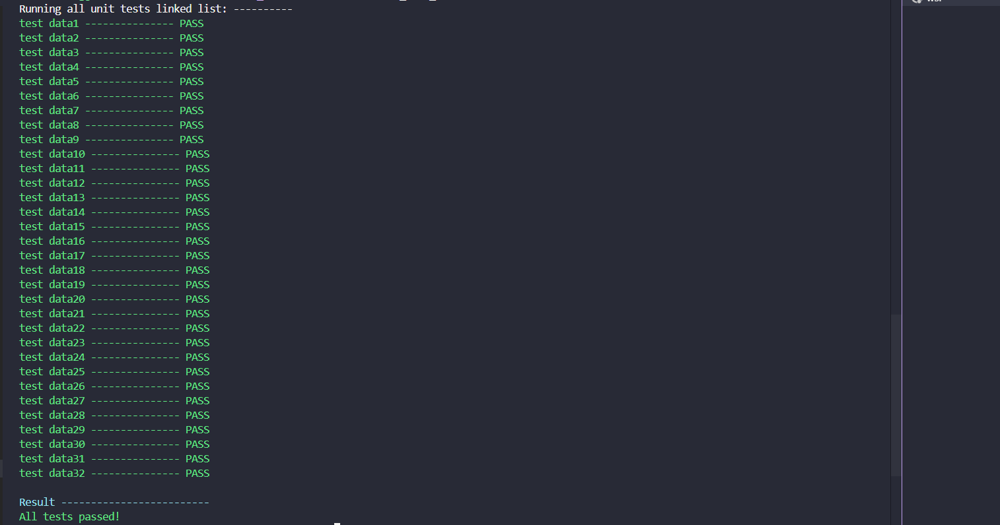

# 🧠 MLP Neural Network Project  

This project provides data structures and utilities to build and run a **Multi-Layer Perceptron (MLP)** neural network in C++17.  
It includes:  
- 📋 **Custom List Structures**: Array-based list (`XArrayList`) and Linked list (`DLinkedList`).  
- 🔢 **XTensor Integration**: For working with multi-dimensional arrays (tensors).  
- 🤖 **MLP Library**: Basic support for dataset creation/splitting and inference.  

---

## ⚙️ Build Instructions  

Make sure you have **g++ (C++17)** installed.  

### 🔨 Build

To build this project, you need to use **Ubuntu** or **WSL (Windows Subsystem for Linux)**.  
The recommended compiler is **g++ with C++17 support**.

```bash
g++ -fsanitize=address -o main -Iinclude -Isrc -std=c++17 \
    main.cpp \
    test/unit_test/arrayList/unit_test.cpp \
    test/unit_test/linkedList/unit_test.cpp \
    test/unit_test/data/unit_test.cpp \
    test/random_test/random_test.cpp \
    src/ann/xtensor_lib.cpp src/util/Point.cpp
```
⚠️ Note for Windows users:
Building directly on Windows (PowerShell or CMD) may cause compilation errors (see screenshot below).


🚀 Run Instructions

You can run different test modes depending on the component you want to check:

✅ Unit Tests

Array List

```bash
./main test_unit_array
./main test_unit_array nameFunctionUnitTest
```

Linked List

```bash
./main test_unit_linkedList
./main test_unit_linkedList nameFunctionUnitTest
```

Dataset

```bash
./main test_unit_data
./main test_unit_data nameFunctionUnitTest
```

🎲 Randomized Tests

```bash
./main test_random number_1 number_2
./main test_random number
```

# 🔔 Notice  

The default **random seed** is set to `0` to ensure that the program produces **deterministic outputs** (same result every run).  
You can find this setting at **line 27** in `include/ann/dataloader.h`.  

👉 If you want to test the code with **random outcomes**, simply **comment out this line**.  



📸 Sample Results
Here are some example outputs from the tests:

# Example: Array List Test

# Example: Linked List Test

# Example: Data Loader Test


✨ Features

Built with modern C++17

Uses xtensor for tensor operations

Implements both array-based and linked-list data structures

Provides a foundation for building and running a Multi-Layer Perceptron